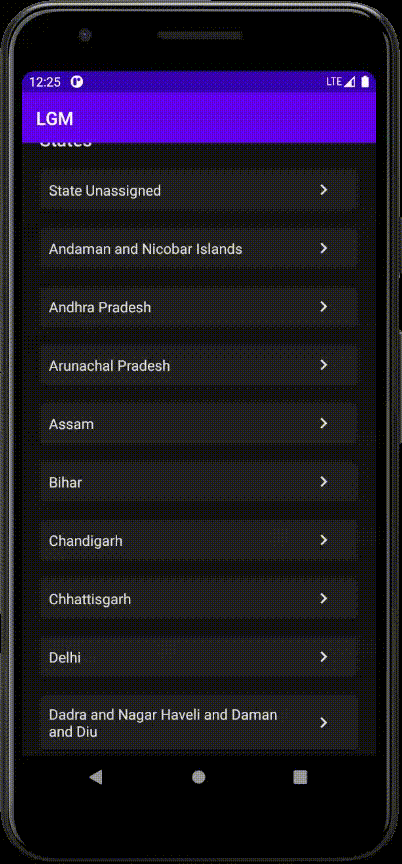

# LGMVIP-android (internship)

## tasks
- **Task 1:** Create a COVID-19 Tracker Android App to See Details of any City and State in India. [view the project](./task1_covid19_tracker_app)

    
    
- **Task 2:** Create a Face Detection Android App usingMachine Learning KIT on Firebase. [view the project](./task2_faceDetection)
    
    